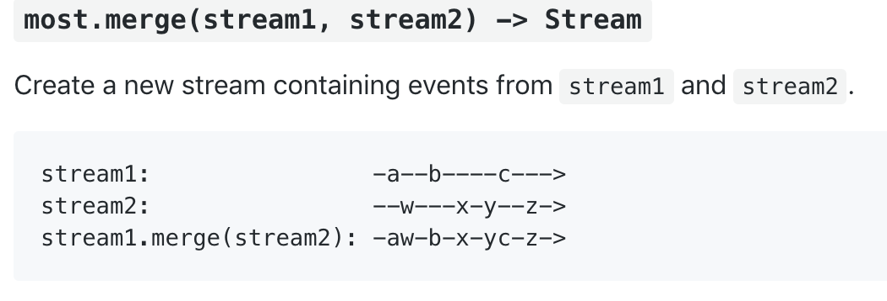
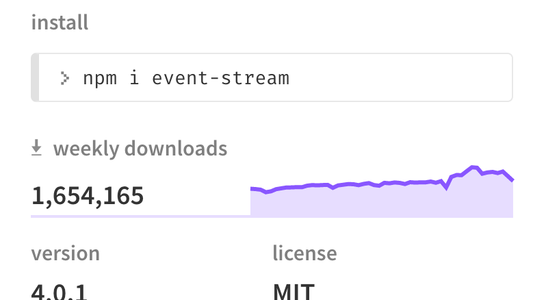

# Reactive Streams

#### Handling complex interaction between events.

---

### Examples

- Live, type-ahead, debounced search.
- Complex coordinated animations.
- Live front-end reloading from backend data changes.

---

## The Theory

We can improve our code

By stealing ideas from functional programming.

---

### Object-ifying Reality

Promises turn single-shot callbacks into first-class values:

```js
// from this:
fs.readFile(path, (err, data) => console.log(data))

// to this:
fs.readFile(path)
    .then((data) => console.log(data))
```

---

### Object-ifying Reality

Reactive streams convert streams of events into first-class values:


```js
// from this:
el.onchange = (value) => { view.innerHTML = value }

// to this:
most.fromEvent(el, 'onchange')
    .observe((value) => { view.innerHTML = value })
```


---

### Object Permanence

- Reactive values are inherently "multi-cast"
- Functions that return reactive values are **composable**
- You can build a vocabulary of tools around these values to solve the same
  problem over and over again.

---

## The Pyramid of Doom

```js
fetchUsers((err, ids) => {
    const id = findActiveUser(ids)
    postGrade(id, grade, () => {
        sendNotification(id, () => {
            screenReaderNotification()
        })
    })
})
```

---

## Promises

```js
// time ->
//
// |-------------->
//
// |--------------o
//
// |--------------x
```

---

## Chaining

```js
// time ->
//
// |-----o
//       |-----o
//             |-----o
//                   |-----o
fetchUsers
    .then((ids) => {
        const id = findActiveUser(ids)
        postGrade(id, grade)
    })
    .then((id) => sendNotification(id))
    .then(() => screenReaderNotification())
```

---

## Combining

```js
// time ->
//
// |---o
// |-----o
//       |--o

Promise.all([fetchStudentIds(), fetchAssessmentId()])
    .then(([ids, assessmentId]) => fetchGrades(ids, assessmentId))
    .then((grades) => renderUI(grades))
```

---

## The Law of Leaky Abstractions
via Joel Spolsky

1. All abstractions are leaky.
2. Fixing the leaks get harder the higher we build.

---

## The Phantom Menace

```js
function loadData () {
    fetchData()
        .then((data) => doComplicatedTransform(data))
        .then((transformed) => renderResults(transformed))
}

async function chainThings () {
    await loadData()
    screenReaderNotification('yay')
}
```

---

## Unmasked

```js
function loadData () {
    fetchData()
        .then((data) => doComplicatedTransform(data)) // boom!
        .then((transformed) => renderResults(transformed))
}


async function chainThings () {
    await loadData()
    screenReaderNotification('yay')
}
```

---

## Banished

```js
function loadData () {
    // begone, phantom error!
    return fetchData()
        .then((data) => doComplicatedTransform(data))
        .then((transformed) => renderResults(transformed))
}

async function chainThings {
    await loadData()
    screenReaderNotification('yay')
}
```

---

## Reactive Streams

- Reactive streams can emit multiple values.
- "resolving" a stream is decoupled from "emitting" data values.

---

## Lifetimes of Reactive Streams

```js
// time ->
//
// |--a-b-c-d|
//
// |---a----------x
//
// |----a------------->
```

---

## Reactive Streams Subsume Promises

```js
// A promise that resolves is a stream that emits a single value and then
// immediately resolves:
// |------o
// |------a|
//
// A promise and a stream can reject:
// |-----x
//
// A promise and a stream can *never* resolve (beware of memory leaks!)
// |------------------>
```

---


---



---

## Complex Stream Processing

Let's say you want to write some code that does live updates from a server:

- Wait for the user to input some data.
- Debounce the input.
- Make a request using that input as a data parameter.
- Display the relevant output.

---

## Simple?

```js
const doRequest = (query) =>
    request(query).then((result) => updateView(result))

input.onchange = _.debounce(doRequest)
```

---

## Too Soon!

```js
// input     |---a---b---------------->
// request a     |-------------ra
// request b         |---rb
// view      |-----------rb----ra!---->
```

---

## Fixed

```js
let ix = 0
const doRequest = (query) => {
    ix += 1
    const current = ix
    return request(query)
        .then((result) => current === ix ? updateView(result) : null)
}

input.onchange = _.debounce(doRequest)
```

---

## Reactive

```js
most.fromEvent(input, 'onchange')
    .debounce()
    .flatMap((query) => most.fromPromise(request(query)))
    .switchLatest()
    .observe(updateView)
```

---

## Advantages

- Streams are first-class objects that can be returned.
- Streams can be shared (in most, via `.multicast()`)

---

## Disadvantages

- Error handling is where promises were five years ago.
- "hot" versus "cold" observables.

---

## Hot vs. Cold

- Promises have three states: resolved, rejected, and pending.
- Chaining `.then` or `.catch` is time-invariant.

---

## Hot Observables

- Do not buffer incoming events.
- Adding observers will do different things at different times.

---

## Cold Observables

- Buffers prior events.
- Observers are now time-invariant again.

---

## Missed Connections

```js
describe('it calls the provided callback three times', async () => {
    const ee = new EventEmitter()
    const spy = sinon.spy((args) => ee.emit('call', args))
    const calls = most.fromEvent(ee, 'call')

    simulateThreeLoadCalls(spy)

    const firstArgs = calls
        .map((args) => args[0])
        .take(3)
        .reduce((acc, cur) => [...acc, cur])

    expect(await firstArgs).toEqual(['call 1', 'call 2', 'call 3'])
}
```

---

## Dude, Where's My Call

```js
describe('it calls the provided callback three times', async () => {
    const ee = new EventEmitter()
    const spy = sinon.spy((args) => ee.emit('call', args))
    const calls = most.fromEvent(ee, 'call').take(3)
        .map((args) => args[0])
        .take(3)
        .reduce((acc, cur) => [...acc, cur])

    performThreeLoads(spy)

    const firstArgs = await calls
    expect(firstArgs.reduce((acc, cur) => [...acc, cur]))
        .toEqual(['call 1', 'call 2', 'call 3'])
})
```

---

## Plugging the Leaks

Reactive streams are a great way to wrap / build event emitters.

---

## Final Thoughts

- The Elephant in the Room
- The npm Way
- When in Rome

---

## The Elephant in the Room

---

## The Elephant in the Room

`event-stream`

---

## The Elephant in the Room



---

## The Elephant Sneaks Into the Room

`not@black.hat`


###### npmjs, Details About the Event Stream Incident

---

## The Elephant is Now Rampaging Around the Room


---

## The npm Way

- most (going 2.0, hopefully soon)
- RxJS
- bacon

---

## When in Rome

- Reactive streams are pretty cool.

---

## When in Rome

- Reactive streams are pretty cool.
- Get everybody on board **before** using them.

---

## tl;dr


---

## Any Questions?


